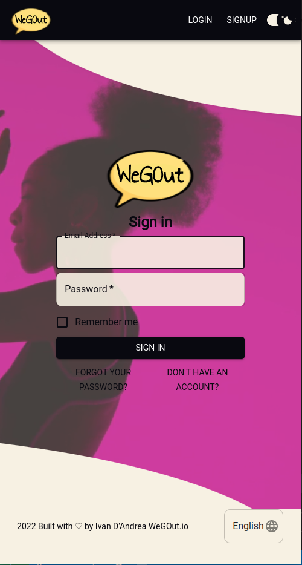

# WeGoOut_Project
## Description
---
Wegout is a web-app which aims to increase people's social life. Basically, it searches for events you are interested in and finds other people to do activities with.

## Client/Front-end
### Technologies
---
- React
- Material UI
- Apollo Client
- CSS
- Typescript


## Server/Backend
### Technologies
---

- Node.JS
- Express.JS
- Graphql
- Apollo Server
- Typescript
- MongoDb
- Redis


## Run Development 
---
```
npm run install-app
npm run dev-server
npm run dev-client
npm run dev

```
## Development Note

Set "request.credentials": "include",
into Graphql PLayGround to recvie session cookie

## Run  
---
```
npm run build
npm run start

```
## Install Note
---
To run you have an a redis server running locally on your machine.
```
redis-client

```

## Feauturs
---

- [Api Query](api-query.md)
- Login/Logout/Signup
- Password Recovery
- User Email Verification
- Update personal info
- Fetch Events basedon Geolocalization
- Filter Events by Categories/Radius/Keywords
- Search People 
- Add "Interest to go.."
- See list of people interest in one event
- Chat
- Push Notification (WIP)
- Chat condition(WIP)
- Limit Chat Based on subscription(WIP)
- Payment system (WIP)
- Dark mode Theme
- Different Languages (Add Translation)


## Some Snapshot
---
### Login


### Hero

### Profile

### Event

### Event Mobile


### Filter

### Event Mobile


### Card


### Event Detail


